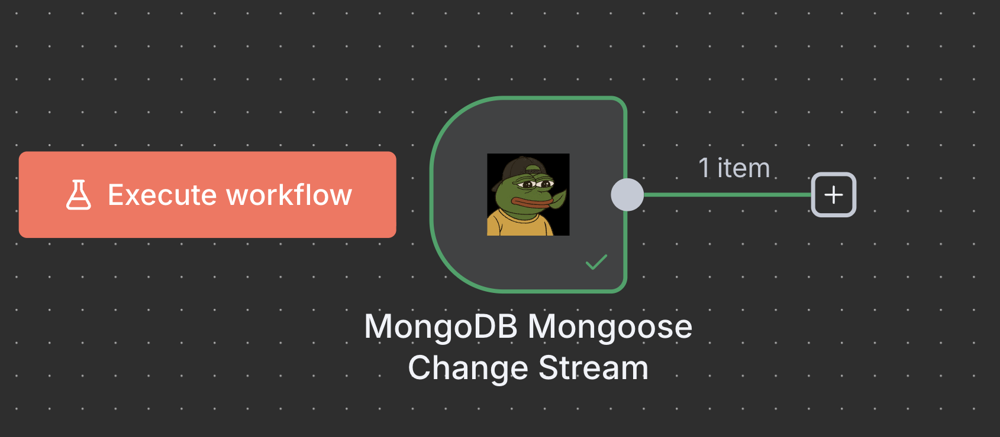
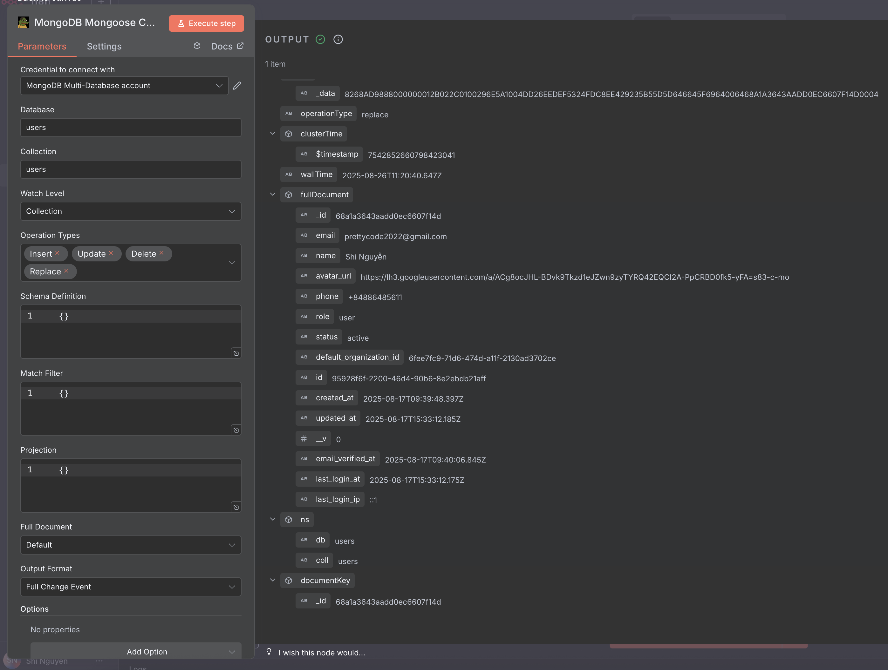

# MongoDB Mongoose - n8n Community Node

<div align="center">
  <h3>Professional MongoDB operations for n8n workflows using Mongoose ODM</h3>

  [](https://badge.fury.io/js/n8n-nodes-mongoose)
  [](https://opensource.org/licenses/MIT)
  [](https://nodejs.org/)
  [](https://www.mongodb.com/)
</div>

## 🎬 In Action

<div align="center">
  
### 🔄 MongoDB CRUD Operations in n8n

*Professional MongoDB operations with full CRUD support, data validation, and error handling*

### 🎯 Real-time Response & Results  

*Live data processing with comprehensive response formatting and change stream monitoring*

</div>

---

## 📋 Table of Contents

- [📦 Installation](#-installation)
- [🚀 Features](#-features)
- [🔧 Available Nodes](#-available-nodes)
  - [MongoDB Mongoose (CRUD Operations)](#mongodb-mongoose-crud-operations)
  - [MongoDB Mongoose Change Stream (Real-time Trigger)](#mongodb-mongoose-change-stream-real-time-trigger)
- [⚙️ Configuration](#️-configuration)
  - [MongoDB Credentials](#mongodb-credentials)
  - [Connection Types](#connection-types)
- [📖 Usage Guide](#-usage-guide)
  - [Basic CRUD Operations](#basic-crud-operations)
  - [Real-time Change Monitoring](#real-time-change-monitoring)
  - [Advanced Features](#advanced-features)
- [🔍 Examples](#-examples)
- [🛠️ Troubleshooting](#️-troubleshooting)
- [🤝 Contributing](#-contributing)
- [📄 License](#-license)

---

## 📦 Installation

### Community Nodes (Recommended)

1. Go to **Settings > Community Nodes** in your n8n instance
2. Select **Install**
3. Enter `n8n-nodes-mongoose` as the npm package name
4. Agree to the risks of using community nodes
5. Select **Install**

### Manual Installation

```bash
# For n8n installed globally
npm install -g n8n-nodes-mongoose

# For n8n installed locally
npm install n8n-nodes-mongoose
```

## 🚀 Features

### Core Capabilities
- ✅ **Full CRUD Operations** - Create, Read, Update, Delete with advanced options
- ✅ **Real-time Change Streams** - Monitor MongoDB changes instantly
- ✅ **Aggregation Pipeline** - Complex data processing and analytics
- ✅ **Schema Validation** - Mongoose ODM integration with type conversion
- ✅ **Replica Set Support** - High availability and production-ready connections
- ✅ **Connection Management** - Automatic connection handling and pooling
- ✅ **Error Handling** - Comprehensive error management and debugging

### Advanced Features
- 🔄 **Date Conversion** - Automatic string-to-date conversion based on schema
- 📊 **Query Optimization** - Built-in query performance monitoring
- 🎯 **Field Selection** - Projection support for optimized data transfer
- 🔐 **Authentication** - Support for various MongoDB authentication methods
- 📝 **Debug Mode** - Detailed logging for development and troubleshooting
- 🚀 **Production Ready** - Optimized for high-performance workflows

## 🔧 Available Nodes

### MongoDB Mongoose (CRUD Operations)
Professional MongoDB operations node with comprehensive CRUD functionality.

**Supported Operations:**
- **Create** - Insert new documents with schema validation
- **Find** - Query multiple documents with filtering, sorting, and pagination
- **Find One** - Query single document with field selection
- **Update/Update One** - Modify existing documents with upsert support
- **Delete/Delete One** - Remove documents with safety checks
- **Aggregate** - Run complex aggregation pipelines with date conversion
- **Count** - Count documents matching query criteria

### MongoDB Mongoose Change Stream (Real-time Trigger)
Real-time MongoDB Change Stream trigger for monitoring database changes.

**Key Features:**
- **Real-time Monitoring** - Instant notifications on data changes
- **Multiple Watch Levels** - Collection, database, or deployment-wide monitoring
- **Operation Filtering** - Filter by insert, update, delete, and other operations
- **Resume Capability** - Continue monitoring from specific points using resume tokens
- **Custom Filtering** - Advanced match filters and projections
- **Multiple Output Formats** - Full event, document only, or simplified format
- **Count** - Count documents matching query criteria

## ⚙️ Configuration

### MongoDB Credentials

This package provides a comprehensive MongoDB credential system supporting various connection types and authentication methods.

#### Connection Types

##### Single Host Connection
Perfect for development and simple deployments:
```
Connection String: mongodb://localhost:27017/mydb
Database: myapp (optional override)
```

##### Replica Set Connection
Production-ready high availability setup:
```
Hosts: rs1.example.com:27017,rs2.example.com:27017,rs3.example.com:27017
Username: myuser
Password: mypassword
Replica Set Name: rs0
Auth Source: admin
Database: myapp
```

#### Authentication Options
- **Auth Source**: Database to authenticate against (typically `admin` for replica sets)
- **SSL/TLS**: Secure connections with certificate validation
- **Connection Pooling**: Optimized connection management
- **Timeouts**: Configurable connection and socket timeouts

#### Advanced Connection Options
| Option | Description | Default |
|--------|-------------|---------|
| **Connection Timeout** | Time to establish connection | 10000ms |
| **Socket Timeout** | Socket operation timeout | 10000ms |
| **Max Pool Size** | Maximum connections in pool | 10 |
| **Min Pool Size** | Minimum connections in pool | 0 |
| **SSL** | Enable secure connections | false |
| **SSL Validate** | Validate SSL certificates | true |

## 📖 Usage Guide

### Basic CRUD Operations

#### Create Documents
```json
// Single document
{
  "name": "John Doe",
  "email": "john@example.com",
  "age": 30,
  "isActive": true
}

// Multiple documents
[
  {"name": "Alice", "email": "alice@example.com"},
  {"name": "Bob", "email": "bob@example.com"}
]
```

#### Query Documents
```json
// Basic queries
{"isActive": true}
{"age": {"$gte": 18, "$lte": 65}}
{"name": {"$regex": "John", "$options": "i"}}

// Complex queries
{
  "isActive": true,
  "age": {"$gte": 18},
  "status": {"$in": ["active", "premium"]},
  "createdAt": {
    "$gte": "2024-01-01T00:00:00.000Z",
    "$lt": "2024-12-31T23:59:59.999Z"
  }
}
```

#### Field Selection
```json
// Include specific fields
{"_id": 1, "name": 1, "email": 1, "createdAt": 1}

// Exclude sensitive fields
{"password": 0, "internalNotes": 0}

// Mixed selection
{"_id": 0, "name": 1, "email": 1, "profile.bio": 1}
```

#### Aggregation Pipeline
```json
[
  {"$match": {"isActive": true}},
  {"$group": {
    "_id": "$department",
    "count": {"$sum": 1},
    "avgAge": {"$avg": "$age"}
  }},
  {"$sort": {"count": -1}},
  {"$limit": 10}
]
```

### Real-time Change Monitoring

#### Basic Change Stream Setup
```json
// Monitor all changes in users collection
Collection: "users"
Watch Level: "Collection"
Operation Types: ["insert", "update", "delete"]
Output Format: "Simplified"
```

#### Advanced Change Stream Configuration
```json
// Schema Definition
{
  "name": {"type": "String"},
  "email": {"type": "String"},
  "created_at": {"type": "Date"},
  "is_active": {"type": "Boolean"}
}

// Match Filter (only active users)
{
  "fullDocument.status": "active",
  "operationType": {"$in": ["insert", "update"]}
}

// Projection (reduce data transfer)
{
  "fullDocument.name": 1,
  "fullDocument.email": 1,
  "operationType": 1,
  "clusterTime": 1
}
```

### Advanced Features

#### Date Conversion
Automatic string-to-date conversion based on schema definition:
```json
// Schema with date fields
{
  "created_at": {"type": "Date"},
  "updated_at": {"type": "Date"},
  "birth_date": {"type": "Date"}
}

// Query with string dates (automatically converted)
{
  "created_at": {"$gte": "2024-01-01T00:00:00.000Z"}
}
```

#### Debug Mode
Enable debug mode in Options for detailed logging:
- Connection status and performance
- Query execution details
- Change stream events
- Error diagnostics

## 🔍 Examples

### E-commerce Order Processing
```json
// Monitor new orders in real-time
Collection: "orders"
Operation Types: ["insert"]
Match Filter: {"fullDocument.status": "pending"}
Output Format: "Document"

// Update order status
Operation: "updateOne"
Query: {"_id": "{{$json.orderId}}"}
Update Data: {"status": "processing", "updated_at": "{{$now}}"}
```

### User Activity Tracking
```json
// Track user login events
Collection: "user_sessions"
Operation Types: ["insert", "update"]
Match Filter: {"fullDocument.event_type": "login"}

// Aggregate user activity
Pipeline: [
  {"$match": {"event_type": "login"}},
  {"$group": {"_id": "$user_id", "login_count": {"$sum": 1}}},
  {"$sort": {"login_count": -1}}
]
```

### Data Synchronization
```json
// Sync changes to external system
Collection: "products"
Operation Types: ["insert", "update", "delete"]
Resume Token: "{{$json.last_resume_token}}"
Output Format: "Full"
```

## 🛠️ Troubleshooting

### Common Issues

#### Connection Problems
```bash
# Error: "Failed to connect to MongoDB"
✅ Check connection string format
✅ Verify MongoDB server is running
✅ Check network connectivity and firewall
✅ Validate authentication credentials
```

#### Change Stream Issues
```bash
# Error: "Change stream failed to initialize"
✅ Ensure MongoDB 3.6+ with replica set
✅ Check user permissions for change streams
✅ Verify collection exists
✅ Review match filter syntax
```

#### Performance Issues
```bash
# Slow query performance
✅ Add appropriate indexes
✅ Use projection to limit fields
✅ Optimize match filters
✅ Enable debug mode for analysis
```

### Debug Mode
Enable debug mode in node options for detailed logging:
- **Connection diagnostics**
- **Query execution plans**
- **Change stream events**
- **Performance metrics**
- **Error stack traces**

### Best Practices

#### Production Deployment
- ✅ Use replica sets for high availability
- ✅ Configure appropriate connection pooling
- ✅ Set up proper authentication and SSL
- ✅ Monitor connection and query performance
- ✅ Implement proper error handling in workflows

#### Performance Optimization
- ✅ Use indexes for frequently queried fields
- ✅ Limit result sets with projection
- ✅ Use aggregation for complex operations
- ✅ Monitor and optimize slow queries
- ✅ Configure appropriate batch sizes for change streams

#### Security
- ✅ Use strong authentication credentials
- ✅ Enable SSL/TLS for production
- ✅ Limit database user permissions
- ✅ Regularly rotate credentials
- ✅ Monitor access logs

## 📞 Contact & Support

For technical support, questions, or collaboration:

**📧 Email:** [prettycode2022@gmail.com](mailto:prettycode2022@gmail.com)

---

## 📄 License

This project is licensed under the MIT License - see the [LICENSE.md](LICENSE.md) file for details.

---

<div align="center">
  <p><strong>⭐ If this package helps your workflow, please consider giving it a star on npm!</strong></p>
  <p><em>Made with ❤️ by prettycode2022</em></p>
  <p>© 2024 prettycode2022. All rights reserved.</p>
</div>
